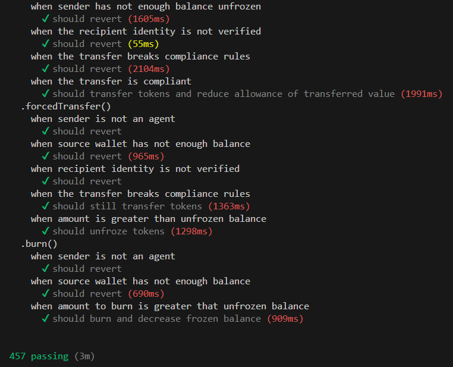
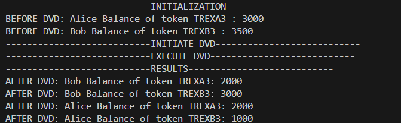

# T-Rex Token Protocol - Enhanced Privacy Edition

## Overview

This repository contains the upgraded version of the T-Rex Token protocol, integrating Fully Homomorphic Encryption Virtual Machine (FHEVM) technology. The protocol is designed to enhance the privacy of token transactions by hiding the transfer amounts, balances, and total supply of the T-Rex Token.

## What is the problem ?

### Privacy Enhancement

In traditional blockchain systems like Ethereum, all transaction details are publicly visible on the blockchain. This includes:

- **Transfer Amounts**: How much of a token is being transferred from one address to another.
- **Balances**: The total amount of tokens held by each address.
- **Total Supply**: The total amount of tokens in circulation.

While this transparency is beneficial for auditability and trust, it can compromise privacy. Anyone can trace transactions, identify patterns, and potentially link addresses to real-world identities. This is particularly concerning for individuals and organizations who prioritize confidentiality in their financial activities.

### Benefits of Hiding Information

1. **Enhanced Privacy**: By hiding transfer amounts, balances, and total supply using FHEVM (Fully Homomorphic Encryption Virtual Machine), the T-Rex Token protocol ensures that sensitive financial data remains private. This is crucial for users who need to conduct transactions without exposing their financial details to the public.

2. **Preventing Financial Surveillance**: In a fully transparent blockchain, it’s easy for anyone to monitor the financial activities of others. By encrypting these details, the T-Rex Token protocol makes it significantly harder for third parties to conduct financial surveillance or track user behavior.

3. **Increased Security**: When financial details are hidden, it reduces the risk of targeted attacks. For example, if a malicious actor can’t see how much wealth is stored in an address, they have less incentive to target that address.

4. **Confidential Business Transactions**: For businesses, maintaining confidentiality in their transactions is critical. Hiding transaction details ensures that business strategies, supply chain payments, and other sensitive activities remain confidential, protecting competitive advantages.

### How Does It Make the T-Rex Token Protocol Better?

1. **Adoption in Privacy-Conscious Industries**: By addressing privacy concerns, the T-Rex Token protocol becomes more appealing to industries and users who require confidentiality, such as healthcare, finance, and supply chain management.

2. **Compliance with Privacy Regulations**: As global regulations increasingly emphasize the protection of personal data, the T-Rex Token protocol’s privacy features can help users and organizations comply with these laws while still leveraging blockchain technology.

3. **Future-Proofing**: Privacy is becoming a critical aspect of blockchain technology as it evolves. By integrating advanced privacy features now, the T-Rex Token protocol positions itself at the forefront of this trend, making it more relevant in the future.

### How Does It Work?

1. **Replacement of Standard Data Types in the T-Rex token**: 
    - The standard `uint256` type used in the ERC20 token contract for storing balances, transfer amounts, and approval amounts has been replaced with a new encrypted data type, `euint64`.
    - `euint64` is a type introduced by FHEVM that represents an encrypted unsigned 64-bit integer. This encryption ensures that all numerical values related to token operations are kept private, even as they are processed within smart contracts.

```javascript
    /// @dev ERC20 basic variables
    mapping(address => euint64) internal _balances;
    mapping(address => mapping(address => euint64)) internal _allowances;
    euint64 internal _totalSupply;
    
    /// @dev Variables of freeze and pause functions
    mapping(address => bool) internal _frozen;
    mapping(address => euint64) internal _frozenTokens;
```
2. **Adapt functions in the T-Rex token that use those values**: 

Example on the approve function : 

```javascript
    // Function needed to be able to send encrypted amount from an EOA
    function approve(
        address spender,
        einput encryptedAmount,
        bytes calldata inputProof
    ) external override returns (bool) {
        approve(spender, TFHE.asEuint64(encryptedAmount, inputProof));
        return true;
    }

    function approve(address _spender, euint64 _amount) public returns (bool) {
        // Sender need to have the rights to access _amount cypher
        require(TFHE.isSenderAllowed(_amount));
        _approve(msg.sender, _spender, _amount);
        emit Approval(msg.sender, _spender);
        return true;
    }

    function _approve(address _owner, address _spender, euint64 _amount) internal virtual {
        require(_owner != address(0), "ERC20: approve from the zero address");
        require(_spender != address(0), "ERC20: approve to the zero address");
        _allowances[_owner][_spender] = _amount;
        // Need to give the rights to _owner, _spender and the contract to access this new cypher
        TFHE.allow(_allowances[_owner][_spender], address(this));
        TFHE.allow(_allowances[_owner][_spender], _owner);
        TFHE.allow(_allowances[_owner][_spender], _spender);
    }
```

One of the most challenging aspects of adapting the T-Rex Token protocol to use FHEVM is ensuring that the system accurately checks whether a token transfer is permitted. In the original ERC20 standard, checking the right to transfer tokens is relatively straightforward, as all relevant data—like balances, allowances, and compliance rules—are stored as plain uint256 values and can be easily compared and verified.

However, with the introduction of encrypted data types like euint64, the process becomes significantly more complex:

- Encrypted Data: Since balances, transfer amounts, and allowances are now encrypted, they cannot be directly compared or processed in the same way as plain integers. Special cryptographic methods must be used to ensure that compliance checks are accurate while preserving the privacy of the data.
- Complex Compliance Requirements: The T-Rex Token protocol, like many other advanced token systems, include various compliance modules that enforce rules such as:
    - **ConditionalTransferModule** : this module allows to require the pre-validation of a transfer before allowing it to be executed.
    - **CountryAllowModule** : This module aims to define the allowed country that an investors can trade the token. 
    - **CountryRestrictModule** : This module aims to define the restricted country that an investors can trade the token. 
    - **MaxBalanceModule** : Aimed at regulating the concentration of token ownership, this module enables the setting of maximum token balances that an investor can hold. Unlike other balance restrictions that might apply at the wallet level, this module enforces the limit at the identity level, ensuring that an investor cannot circumvent the rule by distributing tokens across multiple wallets. This feature is particularly useful for maintaining a broad distribution of token ownership or complying with regulatory caps on investment amounts.
    - **SupplyLimitModule** : This module aims to define the total supply that a token can have. 
    - **TimeExchangeLimitsModule** : This module enforces restrictions on the volume of tokens a holder can transfer within a specified timeframe. The timeframe is customizable, allowing issuers to set daily, weekly, monthly, or any custom period limits. This flexibility ensures adaptability to a wide range of regulatory and policy requirements.
    - **ExchangeMonthlyLimitsModule** : Similar to the Time-Based Exchange Limits module, but with a fixed monthly timeframe. This optimization simplifies the module's logic, offering a gas-efficient solution for monthly transfer volume restrictions to CEXs.
    - **TimeTransfersLimitsModule** : This module limits the total volume of transfers an investor can execute within a customizable timeframe, focusing on peer-to-peer transactions rather than deposits to CEXs. It ensures that the overall volume of transfers remains within predefined limits, excluding transfers between an investor's own wallets to prevent self-transfer loopholes.
    - **TransferFeesModule** : This module introduces the ability to levy fees on token transfers, offering token issuers the flexibility to set the fee percentage and designate a specific wallet to collect these fees. It also allows for the exclusion of certain addresses from the fee mechanism, providing a way to tailor the fee structure to accommodate operational needs or incentivize particular transaction patterns within the ecosystem.
    - **TransferRestrictModule** : Designed to enforce transfer restrictions exclusively to whitelisted addresses, this module ensures that tokens can only be sent to approved destinations. This capability is crucial for scenarios where token transfers need to be routed through intermediary contracts for additional off-chain verifications or other compliance checks, even if the recipient address belongs to an eligible investor. It enhances control over token circulation, aligning with specific compliance or operational strategies.

To maintain these compliance requirements in the context of encrypted data, significant modifications are necessary:
- **Encrypted Compliance Checks** : Each compliance module must be adapted to work with encrypted data. This may involve using homomorphic encryption techniques that allow certain computations to be performed on encrypted data without needing to decrypt it. These checks ensure that the rules are enforced without compromising the privacy provided by euint64.
- **Modular Redesign** : The existing compliance modules, which were originally designed to work with plain uint256 data, need to be redesigned to integrate with the FHEVM environment. This might involve breaking down the logic into smaller, more modular components that can work within the constraints of encrypted operations.
- **Performance Considerations** : Performing operations on encrypted data can be computationally intensive. As a result, the compliance modules must be optimized to minimize the performance impact while still ensuring that all necessary checks are performed.

## Tech Stack

- **Smart Contracts**: Solidity
- **Blockchain**: Ethereum-compatible (FHEVM)
- **Development Environment**: Hardhat
- **Package Manager**: pnpm

## Prerequisites

Before getting started, ensure you have the following installed:

- [Node.js](https://nodejs.org/) (v20.16.0 or later)
- [pnpm](https://pnpm.io/) (v9.6.0 or later)
- [Hardhat](https://hardhat.org/) (v2.22.8 or later)

## WARNING ! Read that before executing anything !

- In this project, i used the latest fhevm hardhat template. Please note that i need to modify the scripts in order to make it works. In the task `taskDeploy`, i get error that ethers cannot find the contract in this location : `await ethers.getContractFactory("fhevm/...");`. I modify it to `await ethers.getContractFactory("fhevmTemp/...");` in order to be able to use the mock mode. 
- And for local node test mode, i need to modify it to `await ethers.getContractFactory("fhevmTemp/fhevm/...");`
- Total supply is set to a cypher because in mint function we need to verify the eligibility of the transfer. So it needs to be a cypher because other values are. I know that maintaining a list of investors make the token not scalable as there will be more and more investors and the `allowEachInvestorToAccessTotalSupply` will be more and more expensive. It can even make the transaction failed because of the max amount of gas in a block. This is a problem that need to be considered, however we have the function `removeInvestor` to remove useless investors from the list and for a security token as the T-REX one. We will not have that many investors. So normally it should be ok. 

## Mock mode

### 1. Clone the Repository

```bash
git clone https://github.com/QiteBlock/fhevm-hardhat-t-rex.git
cd fhevm-hardhat-t-rex
```

### 2. Install Dependencies

```bash
pnpm install
```

### 3. Configure Environment

Rename `.env.example` to `.env.`

### 4. Run tests

```bash
pnpm test:mock
```



### 5. Run coverage

```bash
pnpm coverage:mock
```


## Local node mode

### 1. Clone the Repository

```bash
git clone https://github.com/QiteBlock/fhevm-hardhat-t-rex.git
cd fhevm-hardhat-t-rex
```

### 2. Install Dependencies

```bash
pnpm install
```

### 3. Configure Environment

Rename `.env.example` to `.env.`

### 4. Start Fhevm

```bash
pnpm fhevm:start
```

### 5. Deploy the first token to swap

```bash
pnpm task:deployTREX --token-name TREXA --token-symbol TREXA  
```

### 6. Deploy the second token to swap

```bash
pnpm task:deployTREX --token-name TREXB --token-symbol TREXB 
```

### 7. Deploy the Dvd transfer manager

```bash
pnpm task:deployDVD
```

### 8. Update the .env file with addresses of the deployed contracts

```bash
export TOKEN_TREX_A=TO_BE_DEFINED
export TOKEN_TREX_B=TO_BE_DEFINED
export DVD_MANAGER=TO_BE_DEFINED
```

### 9. Execute the DVD (Delivery vs Delivery)

```bash
pnpm script:executeDVD
```


## Dev network 


### 1. Deployment with my account (Get some Zama token)

#### T-Rex token A

- ClaimTopicsRegistry: 0x21D7A817AC349Bacb8d11A7a8816F0234c04be4a
- TrustedIssuersRegistry: 0x364Af1aD133c171EC952C632B3Adcdaed4d7A0B4
- IdentityRegistryStorage: 0x3C69096593A90A7e57b5453279fD0200C7713743
- IdentityRegistry: 0xc3310b1155f0d70462e3fb8B5f160D67bfE55836
- ModularCompliance: 0x7A502507e5f73C8363149b192B0DBE47426c2BD1
- Token Implementation: 0x7cF8Be79E60DD4cDDaC283615C0d0c03A497923e
- identityImplementationAuthority: 0x434650FAC599C689dbE9067Eb3b78C2cd2516765
- TREXImplementationAuthority: 0xb687B524c617eE34A17c991d3746D5bca9e53953
- TREXFactory: 0x18CF6e20dB450187ebBa683fC1E12447e94A20D4
- ClaimTopicsRegistryProxy: 0xB65312b87FA7c2741675C957952d40dE18800c4a
- TrustedIssuersRegistryProxy: 0xaC66Aab27633820b2CE34EA6F42e3EAE58Abb4c9
- IdentityRegistryStorageProxy: 0x1dD7778b0A870D6eB7d6dBB469A49de7cE0160FE
- IdentityRegistry: 0x17b6d63C331A442055d21a5c2D943b1C5a2fD58c
- Token: 0xD3d16aB1f6942d75947C47D253D678Af3d1fddA5
- ClaimIssuer: 0x51d1cB10f84FBB1e667e3FDA00D4C304cE159C72
- Token Address : 0xD3d16aB1f6942d75947C47D253D678Af3d1fddA5

#### T-Rex token B

- ClaimTopicsRegistry: 0xbB48b28BF9239BD184014F97819FFb09F7619530
- TrustedIssuersRegistry: 0x240eD9a3ed747C5EE3aaA64F1032AaB7568fdf59
- IdentityRegistryStorage: 0xF286117581F6Ea4C52591bAc32902867058870aA
- IdentityRegistry: 0x18b9AB40291366456c0627b7962049134459473D
- ModularCompliance: 0x7981ac1FeD650aa1fD299F84669704B37EadBBA5
- Token Implementation: 0x4beb05CD187f412C0C613D2fA6ba83aF9eE18020
- identityImplementationAuthority: 0x284CB8888406fFca114852dA572086eA2572ab7E
- TREXImplementationAuthority: 0xE228a684CF85e67e960fF4D53CA0dc88846528f2
- TREXFactory: 0x0a138D685C8cffEF49D88b6d8b00E389D6e0Fd8C
- ClaimTopicsRegistryProxy: 0x2e7e0D3728741D4326c7179fBF75718ADbea7197
- TrustedIssuersRegistryProxy: 0x61b45f5ab492236e24F28C96c30c41002205bdde
- IdentityRegistryStorageProxy: 0x8070F4A000715C051EB9193bc7d09C4a3fdcFeC5
- IdentityRegistry: 0x88501334eA247a71c780130E727D395746eDB177
- Token: 0xdE6B91aA4433fDa9eD1608d181A5FbbcAdc3bA0A
- ClaimIssuer: 0x18FE743DE619d1D2a981E797DC800FEf373E2350
- Token Address : 0xdE6B91aA4433fDa9eD1608d181A5FbbcAdc3bA0A

#### DVD Contract

- Transfer Manager Address : 0x04e6b3F413B3EB518dEa2547F80b0C717bDF278d

### 2. Deployment with Zama account 

#### T-Rex token A

- ClaimTopicsRegistry: 0xB59D305341bD3e81023A3719E9245E538d394df1
- TrustedIssuersRegistry: 0xcbCE6559841b75f51862B205a896560aD3904D0e
- IdentityRegistryStorage: 0xfccE1C043c38FEa9F3D5a7680Ef4C150a2CDcA0b
- IdentityRegistry: 0xC16b7D2f0b77CA15179eC280919494116d00A307
- ModularCompliance: 0x4b761135323425599dAeCB6da9Ae0aC4A4020B22
- Token Implementation: 0x772e184790cff7B049eCc93e5D385C0F2DEf7A50
- identityImplementationAuthority: 0x8B4E62632cC0029aD36a63e84ea3d12A624111e9
- TREXImplementationAuthority: 0xf5F56C964133B33377F1F219b42Bd16c4244Ae37
- TREXFactory: 0xC0B5077619d3A2Fb460f41ef7531881481B16480
- ClaimTopicsRegistryProxy: 0x911e8e1ab0493DC560A140103D1602F97DD3FF69
- TrustedIssuersRegistryProxy: 0xEB201909eD7891849475ca5B85004C63AD3D5F35
- IdentityRegistryStorageProxy: 0xf5461FCBFF669Bda6d76f194FA9D53172ac77681
- IdentityRegistry: 0xBD1Cdcd7e5BB7762e981141370110F5EE6eBcdc6
- Token: 0x630bA2F2C2eCed7576F64c439079Af2A0253d695
- ClaimIssuer: 0x0475aE2D213D051A29E7fF2072CdF8d7347fE590
- Token Address : 0x630bA2F2C2eCed7576F64c439079Af2A0253d695

#### T-Rex token B

- ClaimTopicsRegistry: 0xB8C93d533CC05e55133bB8a9989997A3b3B93C4A
- TrustedIssuersRegistry: 0x497b3033ECB4b1B8C1FE4DD2F01448c8f9EC8965
- IdentityRegistryStorage: 0xB3b6cAc9C20238eE6c67668d105515905bfbA95C
- IdentityRegistry: 0xA370D679B69991a9FBea79A58D2f43e1A72D7fb0
- ModularCompliance: 0x2617535a8a280606D71728210Eb8e59863f52b0e
- Token Implementation: 0x8270330e1d6C815c9e943122d99602a5eDA49b07
- identityImplementationAuthority: 0xF2285dC42F21334926145442ebe529B9D5c47e3A
- TREXImplementationAuthority: 0x4a82ed9645DbBf7370ad5A0F4378B1191A4990e4
- TREXFactory: 0x7f8e3AD49F85bE46791d90A125cF50D5F0C1e931
- ClaimTopicsRegistryProxy: 0x7BdAE9D6609a045AB38Bf49aB27edFAD95D8953D
- TrustedIssuersRegistryProxy: 0xBa99395Cd5D5Dfaa00331f15cf59Ac742be0A0A7
- IdentityRegistryStorageProxy: 0xc70d6cFb4B50F44295fD83Ec1d271529924bD7CB
- IdentityRegistry: 0xDef6a0d58bEF6591476A55B26740b4c1Ab8E69f0
- Token: 0xF4Fb71Cf075a207bADa7462a03F8e8BfE3aa871d
- ClaimIssuer: 0x0C027CA42AF7D21FFC231DD4c2Fb8228402dBF49
- Token Address : 0xF4Fb71Cf075a207bADa7462a03F8e8BfE3aa871d

#### DVD Contract

- Transfer Manager Address : 0x3Bfd30061ba098da2077f3583b3a6bBDf9d89f1f

#### Result in Devnet



### 7. License

This project is licensed under the GPL-3.0 License. See the LICENSE file for details.
